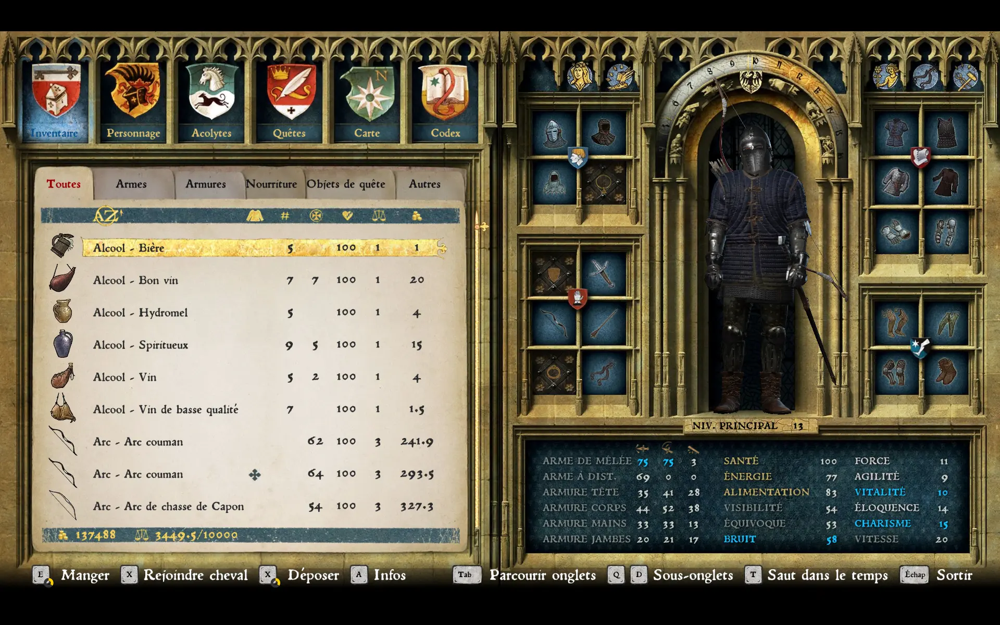

+++
title = 'C++ : Introduction aux References et Pointeurs'
date = 2024-09-11T11:16:17+02:00
draft = false
summary = 'Introduction au concept de références et de pointeurs en C++'
thumbnail = "images/meme-pointeur.jpg"
+++

Ah, les références et les pointeurs en C++ ! Si tu as déjà mis les mains dans le dans un RPG comme Skyrim, tu comprendras vite que c'est là que la vraie magie opère. Ces deux concepts, souvent redoutés, sont pourtant essentiels pour manipuler tes données efficacement, surtout quand il s'agit de gérer tes objets, tes personnages ou n'importe quel PNJ en temps réel dans ton jeu. Laisse-moi t'expliquer tout ça, et tu verras que c’est beaucoup moins effrayant qu’on ne le dit !

## Les références : Simple et Direct

Imaginons que tu es en train de coder l’inventaire de ton héros dans un RPG comme dans Kingdom Come Deliverance (Oui je suis plongé dans ce jeu en ce moment). Les références sont comme un raccourci : elles te permettent de manipuler directement un objet sans en créer une copie.

Prenons un exemple simple. Tu as une classe Personnage avec l'argent du joueur. Grâce à une référence, tu peux afficher et modifier cette valeur à plusieurs endroit du jeu, sans avoir à gérer de copies inutiles de cet objet. Ce qui permet un code plus propre et plus optimisé.



```cpp
class Personnage {
public:
    int gold;
};

void vendre(Personnage& p, int argentGagne) {
    p.gold += argentGagne; // On ajoute directement de l'argent au Personnage !
}

int main() {
    Personnage henry;
    henry.gold = 3449.5;
    
    vendre(henry, 30); // On vend des objets pour une valeur de 30 golds
    std::cout << "Argent après la vente : " << henry.gold << std::endl;
}

```

Ici la fonction `vendre` prend une référence sur le personnage. Si on passait par une copie (sans le `&`), on ne modifierait pas le personnage original ! Ce qui veut dire qu'on devrait copier l'ensemble du personnage, modifier sa valeur, puis le copier de nouveau dans le personnage original.
Dans un vrai jeu, un personnage peu posséder des centaines de variable qui le définisse, ainsi que son inventaire etc... Imagine les ralentissements subit s'il fallait copier toutes ces valeurs à chaque action.

La référence permet de ne pas avoir de doublon de mémoire et des changements en temps réels sur le personnage !

## Les pointeurs : Le niveau Avancé

Maintenant, les pointeurs. C'est un peu plus délicat, mais indispensable pour gérer des grandes quantités d'objets, par exemple l'ensemble des PNG d'un RPG, ou les unités d'un RTS.


Un pointeur est une variable qui stocke des adresses mémoire. On dit qu'il "pointe" sur cette adresse, c'est à dire, qu'il indique l'emplacement dans la mémoire où l'objet est stocké. Là où c'est puissant, c'est quand tu veux manipuler directement cet object, ou vérifier si un objet existe (ou non) avant de l'utiliser.

```cpp
class Arme {
public:
    std::string nom;
    int degats;
};

void attaquer(Arme* a) {
    if (a != nullptr) {
        std::cout << "Utilisation de l'arme : " << a->nom << " avec " << a->degats << " points de dégâts." << std::endl;
    } else {
        std::cout << "Pas d'arme équipée !" << std::endl;
    }
}

int main() {
    Arme* epee = new Arme{"Épée du seigneur Radzig", 50}; // Création d’une arme dynamique (via pointeur)
    utiliserArme(epee);
    
    Arme* aucuneArme = nullptr; // Le personnage n'a pas d'arme équipée
    utiliserArme(aucuneArme); // On vérifie avant d'utiliser l'arme
    
    delete epee; // On n'oublie pas de libérer la mémoire !
}
```

Dans cet exemple, on utilise un pointeur pour gérer une arme. Le pointeur peut être `nullptr` (rien, en gros). C’est super important de vérifier si ton pointeur n’est pas nul avant de l'utiliser, car sinon, tu risques de causer des crashs, comme dans le bug célèbre de [CrowdStrike](https://next.ink/144464/crowdstrike-donne-des-details-techniques-sur-son-fiasco/) qui causait des plantages dans des applications à cause de pointeurs non vérifiés.

### Pourquoi Vérifier un Pointeur ? Utilisation de `nullptr`
Revenons à notre RPG. Imagine un combat épique notre cher Henry veut utiliser une arme, mais si le jeu tente d’utiliser un pointeur `nullptr` (parce qu'il a oublié de vérifier si l'arme est équipée), le jeu pourrait planter. C’est littéralement le cauchemar pour un développeur ! C’est un peu comme si, dans le code, tu disais "vas-y, attaque avec cette arme !" et que le jeu répondait "euh... quelle arme ?". Boom, le crash. Toujours vérifier si un pointeur est nul avant de l'utiliser !

### Pointeurs Dynamiques : Attention à la Mémoire
Les pointeurs sont puissants, mais ils demandent un peu de ménage. Dans un gros jeu comme Kingdom Come, tu ne peux pas te permettre de laisser traîner de la mémoire inutilisée. Si tu crées des objets avec `new`, il faudra aussi les supprimer avec `delete`. C’est comme ranger son atelier après avoir tout utilisé — si tu ne le fais pas, ça devient vite le chaos (aussi appelé **fuite mémoire**).

## Inspection de la mémoire

(Article en cours... petit passage sous CheatEngine)
